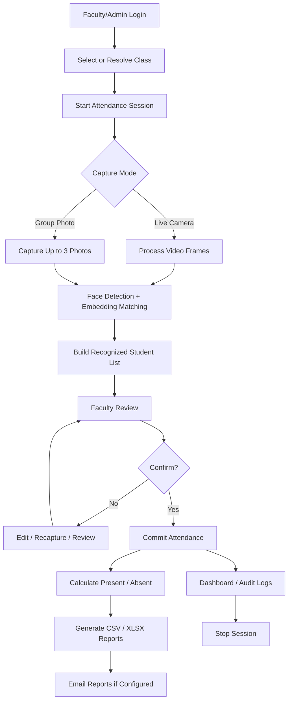
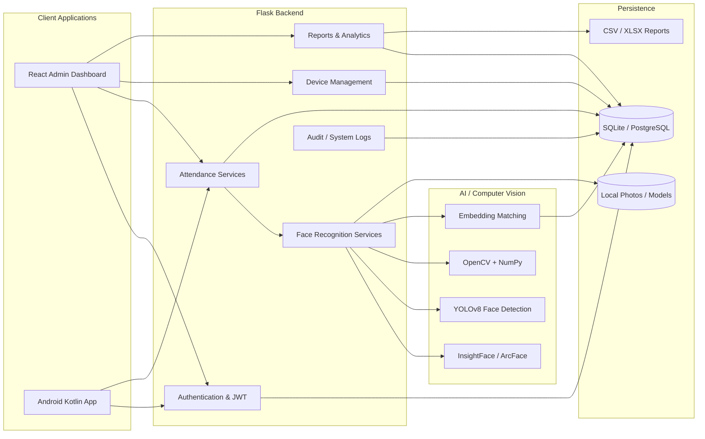
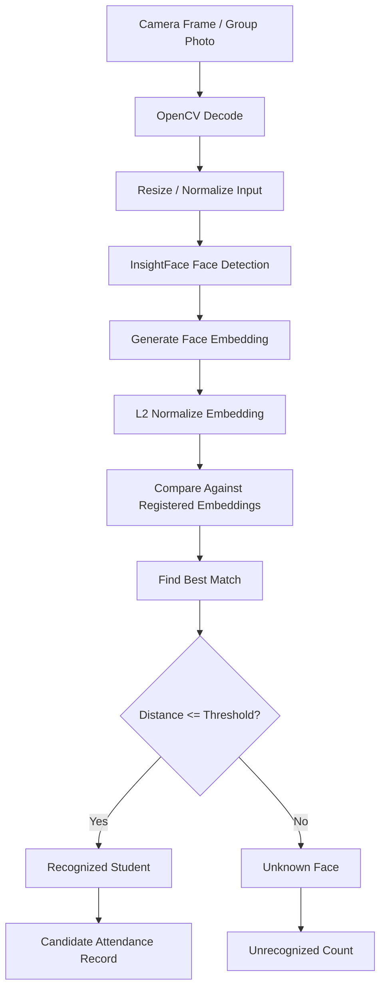
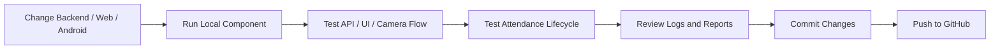
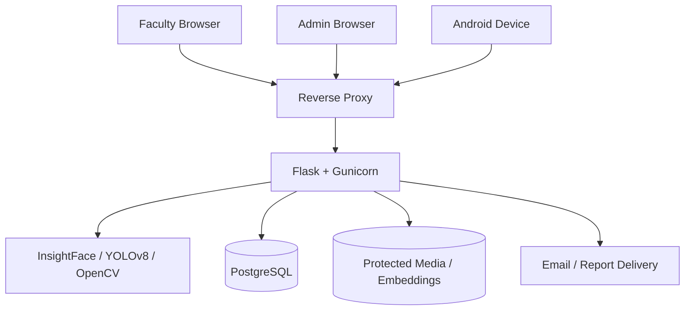

# FaceAttend — Face Recognition Attendance & Biometric Management System

> A full-stack, contactless attendance platform that combines face recognition, group-photo attendance, an admin web dashboard, and an Android attendance client.

[](#technology-stack)
[](#technology-stack)
[](#technology-stack)
[](#face-recognition-pipeline)
[](#data-and-storage)

---

## 1. Overview

**FaceAttend** is a multi-client biometric attendance system designed for classrooms and similar controlled environments. The system uses deep-learning face detection and face embeddings to identify students and records attendance only after the faculty reviews and confirms the recognition results.

The repository contains three major applications:

- **Flask backend** — authentication, attendance sessions, face recognition, reports, devices, audit logs, and database access.
- **React/TypeScript admin portal** — administration, dashboards, student/faculty management, timetables, attendance sessions, devices, and logs.
- **Kotlin Android client** — camera-based attendance capture from an Android phone/tablet acting as a mobile or kiosk terminal.

The system supports both **live camera recognition** and **group-photo recognition**, making it suitable for individual check-ins as well as classroom-wide attendance.

---

## 2. What the System Does

### Main workflow



### Why review and confirmation matter

Recognition results are treated as **proposed attendance**, not immediately committed attendance. Faculty can review detected students, edit records, and then confirm the final list. This makes the attendance workflow human-reviewed rather than fully automatic.

---

## 3. High-Level Architecture



---

## 4. Core Components

### 4.1 Flask Backend

The backend is the central coordination layer. It exposes versioned REST APIs under `/api/v1` and contains:

| Component | Responsibility |
|---|---|
| `api/` | HTTP routes and request/response handling |
| `services/` | Business logic for attendance, reports, authentication, etc. |
| `face_engine/` | Face detection, embeddings, matching, and group recognition |
| `models/` | SQLAlchemy database models and persistence |
| `middleware/` | Authentication/security request middleware |
| `utils/` | Shared utilities and helpers |

Important API areas include authentication, students, faculty, timetable, attendance sessions, attendance records, reports, admin functions, logs, devices, and health checks.

### 4.2 Admin Web Dashboard

The web application is a React 18 + TypeScript + Vite frontend. Its development server runs on port **3000** and proxies `/api` requests to the Flask backend on port **5000**.

Typical responsibilities:

- Dashboard metrics
- Student and faculty roster management
- Timetable/class management
- Attendance session monitoring
- Device management
- Attendance/report review
- Audit/system logs

### 4.3 Android Application

The Android application is written in Kotlin and uses Jetpack Compose, CameraX, Retrofit, OkHttp, and coroutines.

It is intended to turn an Android device into a mobile attendance terminal.

---

## 5. Face Recognition Pipeline



### Matching concept

For a query embedding `q` and stored normalized embedding `x`:

```text
q_norm = q / ||q||
score_distance = 1 - dot(q_norm, x)
```

The system selects the closest stored embedding and accepts it when the distance is within the configured threshold.

The codebase uses different thresholds for different recognition contexts. Live recognition uses a stricter default than group-photo recognition, where the system is designed to recover more faces from classroom images.

### Group recognition

Group-photo recognition can combine InsightFace detection with an optional YOLOv8 face-detection sweep. When a YOLO model is available, additional detected regions can be cropped and passed through the recognition pipeline to improve coverage of smaller/background faces.

---

## 6. Attendance Session Lifecycle

The backend supports the following session operations:

| Operation | Endpoint |
|---|---|
| Start session | `POST /api/v1/attendance/sessions/start` |
| Get session | `GET /api/v1/attendance/sessions/<session_id>` |
| Live recognition | `POST /api/v1/attendance/sessions/<session_id>/recognize` |
| Group capture | `POST /api/v1/attendance/sessions/<session_id>/capture` |
| Review group photos | `POST /api/v1/attendance/sessions/<session_id>/review` |
| Confirm attendance | `POST /api/v1/attendance/sessions/<session_id>/confirm` |
| Stop session | `POST /api/v1/attendance/sessions/<session_id>/stop` |
| Session results | `GET /api/v1/attendance/sessions/<session_id>/results` |
| Update records | `POST/PUT /api/v1/attendance/sessions/<session_id>/update-records` |

The important design principle is:

```text
Capture → Recognize → Review → Confirm → Persist → Report
```

Attendance is not considered final until the confirmation stage.

---

## 7. Authentication & Authorization

The backend exposes an authentication API under `/api/v1/auth`:

- `POST /login`
- `POST /refresh`
- `POST /logout`
- `GET /me`
- `POST /change-password`

Protected endpoints use JWT-based authentication. Role checks distinguish administrative and faculty operations. Device registration/status management is also protected according to role and device state.

---

## 8. Technology Stack

| Layer | Technologies |
|---|---|
| Backend | Python 3.11, Flask, Flask-CORS, Gunicorn |
| API | REST, JSON, JWT authentication |
| Computer Vision | OpenCV, NumPy |
| Face AI | InsightFace / ArcFace, `buffalo_sc` model pack |
| Group Detection | Ultralytics YOLOv8, optional `yolov8n-face.pt` |
| ORM | SQLAlchemy |
| Database | SQLite for local development, PostgreSQL supported |
| Web Frontend | React 18, TypeScript, Vite |
| Styling | Tailwind CSS |
| HTTP Client | Axios |
| Icons | Lucide React |
| Android | Kotlin, Jetpack Compose |
| Android Camera | CameraX |
| Android Networking | Retrofit, OkHttp, Gson |
| Async | Kotlin Coroutines |
| Deployment | Docker, Gunicorn, Nginx-compatible reverse proxy |
| Reporting | CSV / XLSX export |

---

## 9. Repository Structure

```text
face-recognition-mpc/
│
├── admin-web/                         # React + TypeScript admin portal
│   ├── src/                           # Pages, components, services, API client
│   ├── package.json
│   └── vite.config.ts                 # Dev server + /api proxy
│
├── android-app/                       # Native Android application
│   ├── app/
│   │   └── src/main/
│   │       ├── java/...               # Kotlin source
│   │       └── AndroidManifest.xml
│   ├── build.gradle.kts
│   └── settings.gradle.kts
│
├── backend/                           # Modular Flask application
│   ├── api/                            # REST API blueprints
│   │   ├── auth_routes.py
│   │   ├── device_routes.py
│   │   ├── session_routes.py
│   │   └── ...
│   ├── face_engine/                   # Recognition engine
│   │   ├── embedding_service.py
│   │   ├── group_recognizer.py
│   │   └── ...
│   ├── middleware/                     # Auth/security middleware
│   ├── models/                         # Database models
│   ├── services/                       # Attendance/report/business logic
│   ├── utils/                          # Shared utilities
│   ├── config.py
│   └── app.py                          # Modular application entry point
│
├── app.py                              # Root-level server launcher
├── database.py                          # Root-level/legacy database support
├── seed_db.py                           # Database seed utility
├── requirements.txt                     # Root Python dependencies
├── backend/requirements.txt             # Modular backend dependencies
├── Dockerfile
├── .gitignore
└── README.md
```

> **Note:** The repository contains both root-level Python files and the newer modular `backend/` structure. When developing against the modular backend, prefer the files and dependencies under `backend/`; verify the root `app.py`/Docker entry point when using the existing container workflow.

---

## 10. Prerequisites

Recommended development environment:

- **Python 3.11**
- **Node.js 18+** and npm
- **Android Studio** with JDK 17 for the Android module
- **Git**
- At least several GB of free disk space for Python/AI dependencies and model files
- Optional: Docker and Docker Compose-compatible tooling

A CPU-only setup is supported by the current backend configuration.

---

## 11. Local Setup

### 11.1 Clone the repository

```bash
git clone https://github.com/Hetansh20/face-recognition-mpc.git
cd face-recognition-mpc
```

### 11.2 Backend

Create a virtual environment:

```bash
python3 -m venv venv
source venv/bin/activate
```

Windows PowerShell:

```powershell
python -m venv venv
.\venv\Scripts\Activate.ps1
```

Install the modular backend dependencies:

```bash
pip install --upgrade pip
pip install -r backend/requirements.txt
```

Create a `.env` file for local configuration. A typical development configuration can contain:

```env
FLASK_ENV=development
DEBUG=True
HOST=0.0.0.0
PORT=5000

SECRET_KEY=change-me
JWT_SECRET_KEY=change-me
JWT_REFRESH_SECRET_KEY=change-me

DATABASE_URL=sqlite:///./attendance_system.db

COSINE_MATCH_THRESHOLD=0.55
GROUP_MATCH_THRESHOLD=0.75

CORS_ORIGINS=http://localhost:3000
```

Configure email settings only if automated report delivery is required.

### 11.3 Seed the database

If the project data required by your local setup is available:

```bash
python seed_db.py
```

The seed utility can initialize academic data and derive student records from local face-registration data when those files are present.

### 11.4 Start the Flask backend

For the modular backend, use the entry point appropriate to the current checkout/configuration. The repository's modular application is under `backend/app.py`.

```bash
python backend/app.py
```

The development API is expected at:

```text
http://localhost:5000
```

Health endpoint:

```text
/api/v1/health
```

> AI models may need to be downloaded or supplied locally on first use. Model files are intentionally excluded from Git because they are large.

---

## 12. Admin Web Setup

From the repository root:

```bash
cd admin-web
npm install
npm run dev
```

The Vite configuration uses port **3000** and proxies `/api` to:

```text
http://localhost:5000
```

Open the dashboard at:

```text
http://localhost:3000
```

For a production build:

```bash
npm run build
npm run preview
```

---

## 13. Android Setup

1. Open `android-app/` in Android Studio.
2. Allow Gradle to sync the project.
3. Ensure JDK 17 is configured.
4. Start an Android emulator or connect a physical device.
5. Configure the Android API base URL for your backend.
6. Build and run the app.

For the Android Emulator, the host machine is normally reachable as:

```text
http://10.0.2.2:5000
```

For a physical device, use the computer's LAN IP, for example:

```text
http://192.168.x.x:5000
```

Make sure the device and computer can reach each other and that the backend is listening on an accessible interface.

The Android module targets API 34, has a minimum SDK of API 26, and uses CameraX for camera functionality.

---

## 14. Docker Deployment

The repository contains a Dockerfile using a Python 3.11 slim base image and system libraries required by the computer-vision stack.

A typical build/run flow is:

```bash
docker build -t faceattend .
docker run --rm -p 8080:8080 --env-file .env faceattend
```

The existing container configuration starts Gunicorn with a single worker, multiple threads, and an extended timeout for AI workloads.

```text
Client
  ↓
Reverse Proxy / Load Balancer
  ↓
Gunicorn
  ↓
Flask API
  ↓
Face Engine + Services
  ↓
Database / Local Storage
```

> Before production deployment, review the root Docker entry point and environment variables because the repository contains both root-level and modular Flask application structures.

---

## 15. Data & Storage

The project intentionally keeps generated data out of Git. The `.gitignore` covers categories such as:

- `.env` files and credentials
- Android `local.properties`
- keystores and private keys
- SQLite/database files
- AI model files (`.pt`, `.pth`, `.onnx`, etc.)
- face embedding caches
- registered face photographs
- uploads and generated attendance reports
- CSV/XLSX exports
- logs and temporary files

---

## 16. Reporting & Analytics

The reporting service provides operational metrics and export functionality, including:

- Dashboard statistics
- Attendance summaries
- Session-specific present lists
- Session-specific absent lists
- CSV exports
- XLSX exports
- Audit/system logs

Absent students are calculated from the expected enrolled roster minus students recorded as present for the session.

---

## 17. API Overview

The backend is organized around versioned APIs:

```text
/api/v1/
├── auth/
├── students/
├── faculty/
├── timetable/
├── attendance/
│   └── sessions/
├── reports/
├── admin/
├── logs/
├── devices/
└── health
```

For exact request and response schemas, inspect the corresponding route modules under `backend/api/`.

---

## 18. Development Workflow

A typical feature workflow is:



For changes affecting face recognition, test both individual/live and group-photo scenarios. For changes affecting attendance logic, test the complete **start → recognize → review → confirm → report → stop** lifecycle.

---

## 19. Deployment Topology



For a small local deployment, SQLite can replace PostgreSQL and the reverse proxy can be omitted.

---

## 20. Known Repository Notes

- AI model files, face images, embedding caches, databases, and reports are intentionally ignored by Git.
- The repository has both root-level Python files and a modular `backend/` application. Developers should be aware of this when switching between local execution and the existing Docker workflow.
- The Android application is configured for local HTTP development; production deployments should use secure HTTPS.
- Exact model-download behavior can depend on the installed InsightFace/Ultralytics versions and local environment.

---

## 21. License

No explicit open-source license is currently identified in the repository. Unless a license is added, normal copyright restrictions apply to the project source code.

If this project is intended for public reuse, consider adding an appropriate license file such as MIT, Apache-2.0, or another license selected by the project owner.

---

## 22. Acknowledgements

This project builds on open-source technologies including Flask, React, Vite, Kotlin, Jetpack Compose, CameraX, OpenCV, InsightFace, Ultralytics YOLO, SQLAlchemy, Retrofit, and OkHttp.

---

## 23. Quick Start Summary

```text
1. Clone repository
       ↓
2. Create Python virtual environment
       ↓
3. Install backend/requirements.txt
       ↓
4. Configure .env
       ↓
5. Seed local database if required
       ↓
6. Start Flask backend on :5000
       ↓
7. Start React admin portal on :3000
       ↓
8. Configure Android API URL
       ↓
9. Start an attendance session
       ↓
10. Capture live frames or group photos
       ↓
11. Review recognition results
       ↓
12. Confirm attendance
       ↓
13. Generate present/absent reports
```

---

**FaceAttend** is designed as a complete attendance workflow rather than only a face-recognition demo: identity recognition, session management, human review, persistence, reporting, device control, and administrative visibility are all part of the system.